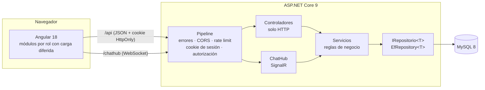

# ServiceDesk TI

[](https://github.com/dannn-36/ServiceDeskTI-Angular/actions/workflows/ci.yml)


Mesa de servicio de TI con cuatro roles (cliente, agente, supervisor y administrador),
asignación automática de tickets por carga de trabajo, chat en tiempo real por ticket,
paneles con métricas reales, reportes PDF y bitácora de auditoría.

**Backend:** ASP.NET Core 9 · EF Core 9 (MySQL) · SignalR · QuestPDF
**Frontend:** Angular 18 · Chart.js · SignalR client · Tailwind

---

## Qué hace cada rol

| Rol | Puede |
|---|---|
| **Cliente** | Abrir tickets (por categoría) y conversar en vivo con el agente asignado. Solo ve sus propios tickets. |
| **Agente** | Atender los tickets que tiene asignados: chat, estado y prioridad. Indica si está **disponible** para el reparto automático. |
| **Supervisor** | Panel del equipo: carga por agente, tickets prioritarios, escalaciones, tickets fuera de SLA, reasignación y escalado, redistribución automática de carga, intervención en chats y reportes PDF (carga, semanal e individual). |
| **Administrador** | Gestión de usuarios y roles, todos los tickets, gráficas, respaldo y restauración de la base de datos y **bitácora de auditoría**. |

## Lo más destacable

- **Asignación automática por carga.** Cada ticket nuevo va al agente disponible con menos tickets activos. El supervisor puede repartir los que no tienen agente o **equilibrar la carga** del equipo; nunca se mueve un ticket que ya está en curso.
- **Chat en tiempo real** con SignalR. El autor de cada mensaje lo decide el servidor a partir de la sesión: no se puede escribir haciéndose pasar por otra persona.
- **Métricas medidas, no inventadas.** La tasa de resolución, el tiempo promedio, las escalaciones y el SLA salen de la base de datos. Lo que el sistema todavía no mide (satisfacción del cliente) se muestra como «N/D» en lugar de inventarlo.
- **Reportes PDF reales** generados con QuestPDF.
- **Bitácora de auditoría** de solo lectura: inicios de sesión, intentos fallidos, altas y bajas, asignaciones, respaldos…
- **Carga diferida por rol.** El login pesa 359 KB y el código de cada panel solo se descarga si el rol puede entrar.

---

## Arquitectura



Reglas que sigue el código:

- **Los controladores no tocan la base de datos.** Traducen HTTP a llamadas de servicio y nada más; no hay `try/catch` repetido porque un manejador global (`Common/ManejadorGlobalErrores.cs`) convierte las excepciones del dominio en códigos HTTP.
- **Los servicios contienen la lógica.** `TicketService` (alta, cambios, asignación, balanceo), `MetricasService` (paneles e indicadores), `UsuarioService`, `SesionService`, `AuditoriaService`, `ReportesPdfService`, `RespaldoService`…
- **Un solo repositorio genérico** (`EfRepository<T>`) en lugar de catorce clases idénticas.
- **La API solo intercambia DTOs** (`Models/Dtos`). Ninguna respuesta incluye la entidad `Usuario` ni su contraseña, y ninguna petición puede rellenar campos que no le corresponden.
- **Todo es asíncrono** (`async/await` con `CancellationToken` de extremo a extremo).
- **Las fechas viajan en UTC.** Una convención de EF Core marca como UTC todas las fechas leídas de MySQL, para que el navegador las muestre en la hora local correcta.
- **Resiliencia.** Las consultas se reintentan ante cortes transitorios de MySQL, y las operaciones de varios pasos (como crear un usuario con su rol) son transaccionales.

## Seguridad

| Medida | Detalle |
|---|---|
| Autenticación | Cookie **HttpOnly + SameSite=Strict** (Secure en producción). JavaScript no puede leerla, así que un XSS no puede robar la sesión. |
| Sesión revocable | La cookie lleva el id de sesión, y **cada petición comprueba en la tabla `sesiones`** que siga abierta y que la cuenta siga activa. Cerrar sesión o desactivar a un usuario invalida su cookie al instante, aunque no haya caducado. |
| Autorización | Política global «requiere sesión» + `[Authorize(Roles = …)]` por endpoint + comprobación de **propiedad del recurso** (un cliente solo ve sus tickets; un agente solo los asignados). |
| Fuerza bruta | Límite de intentos de login por IP (configurable; 429 al superarlo). |
| Enumeración de usuarios | El login responde lo mismo, y tarda lo mismo, con un correo inexistente que con una contraseña incorrecta. |
| Contraseñas | BCrypt; mínimo 8 caracteres; el hash nunca sale en una respuesta (DTOs + `[JsonIgnore]`). |
| Secretos | Ninguna credencial en el repositorio: la cadena de conexión va en *user-secrets* (desarrollo) o en variables de entorno (producción). |
| Respaldo | Solo administración. La contraseña de MySQL se pasa por variable de entorno al proceso, no por línea de comandos. |
| Auditoría | Registro inalterable desde la API (no existe un `POST` público a la bitácora). |
| Errores | Los mensajes internos se escriben en el log del servidor; el cliente recibe un mensaje genérico. |
| Frontend | Guards por rol con `canMatch`; un interceptor devuelve al login ante un 401. |

---

## Puesta en marcha

### Opción A — Docker (recomendada)

Solo hace falta [Docker Desktop](https://www.docker.com/products/docker-desktop/). Desde la raíz del repositorio:

```bash
docker compose up --build
```

y abre **http://localhost:8080**. Se levantan tres contenedores:

| Contenedor | Qué hace |
|---|---|
| `db` | MySQL 8. La primera vez ejecuta `Database/DatabaseScript.txt` (tablas y catálogos). Los datos se guardan en un volumen. |
| `api` | La API .NET 9, con un usuario de MySQL limitado a su base (no root) y las herramientas para el respaldo. |
| `web` | Angular compilado y servido por nginx, que además reenvía `/api` y el WebSocket del chat a la API. |

Al arrancar sobre una base vacía se crean el administrador inicial y un **escenario de demostración** (16 tickets, conversaciones, un agente no disponible, tickets vencidos y urgentes sin asignar) para que todos los paneles tengan contenido:

| Rol | Correo | Contraseña |
|---|---|---|
| Administrador | `admin@servicedesk.local` | `Admin12345!` |
| Supervisor | `supervisor@servicedesk.local` | `Demo12345!` |
| Agentes | `agente1@servicedesk.local` … `agente3@` | `Demo12345!` |
| Clientes | `cliente1@servicedesk.local` … `cliente4@` | `Demo12345!` |

Para cambiar las contraseñas, el puerto o desactivar la demo, copia `.env.example` a `.env` y edítalo.
Comandos útiles:

```bash
docker compose logs -f api         # ver los registros de la API
docker compose down                # parar (los datos se conservan)
docker compose down -v             # parar y BORRAR la base de datos para empezar de cero
curl http://localhost:8080/health  # estado de la API y de su conexión con MySQL
```

MySQL queda accesible en `localhost:3307` para usarlo con MySQL Workbench.

### Opción B — Sin Docker (desarrollo con Visual Studio)

#### Requisitos

- .NET SDK 9
- Node.js 20 o superior
- MySQL 8 (y sus herramientas `mysqldump` y `mysql` si se usa el respaldo)

#### 1. Base de datos

Ejecuta `Database/DatabaseScript.txt` en MySQL. Crea las tablas y los catálogos (niveles de acceso, estados y categorías).

#### 2. Cadena de conexión (fuera del repositorio)

```bash
cd ServiceDeskNg.Server
dotnet user-secrets set "ConnectionStrings:ServiceDeskDB" "Server=localhost;Port=3306;Database=servicedesk;User=TU_USUARIO;Password=TU_CLAVE;"
```

En producción usa la variable de entorno `ConnectionStrings__ServiceDeskDB`.
Las rutas de `mysqldump`/`mysql`, las horas de SLA y el límite de intentos de login están en `appsettings.json`.

#### 3. Ejecutar

Desde Visual Studio, inicia `ServiceDeskNg.Server` (el proxy de SPA arranca Angular solo). O bien, en dos terminales:

```bash
# Terminal 1 — API en http://localhost:5076
cd ServiceDeskNg.Server
dotnet run

# Terminal 2 — Angular en http://localhost:59435 (reenvía /api y /chathub a la API)
cd servicedeskng.client
npm install
npm start
```

---

## Pruebas

```bash
# Backend: 75 pruebas (unitarias de servicios + integración de la API completa)
dotnet test ServiceDeskNg.Tests

# Frontend: 27 pruebas (sesión, guards, interceptor, chat, filtros, utilidades)
cd servicedeskng.client
npx ng test --watch=false --browsers=ChromeHeadless
```

Las pruebas de integración levantan la API real (pipeline, cookies, autorización) sobre una base de datos en memoria sembrada con los mismos catálogos que el script SQL. Entre otras cosas, verifican que:

- sin sesión, la API responde 401, y con un rol insuficiente, 403;
- tras cerrar sesión, una copia de la cookie deja de funcionar;
- un cliente no puede leer ni escribir en el chat de un ticket ajeno, ni crear tickets a nombre de otro;
- un agente solo puede editar los tickets que tiene asignados;
- ninguna respuesta contiene el hash de la contraseña;
- el login se bloquea tras demasiados intentos;
- los reportes son PDF válidos.

GitHub Actions (`.github/workflows/ci.yml`) ejecuta ambas baterías y el build de producción en cada push.

---

## Estructura

```
ServiceDeskNg.Server/
├── Controllers/        Endpoints HTTP, sin lógica de negocio
├── Hubs/ (hubs/)       ChatHub de SignalR
├── Services/           Reglas de negocio, métricas, reportes, respaldo
├── Repositories/       EfRepository<T> + IRepositorio<T>
├── Models/             Entidades de EF Core (generadas desde MySQL)
├── Models/Dtos/        Contratos de entrada y salida de la API
├── Security/           Roles, claims, resolución de rol, identidad de la cookie
├── Common/             Manejador global de errores, opciones (SLA, respaldo)
└── Data/               DbContext + convenciones (fechas UTC)

ServiceDeskNg.Tests/
├── Unitarias/          TicketService, UsuarioService, MetricasService
├── Integracion/        Seguridad y flujos de tickets sobre la API real
└── Infraestructura/    Datos de prueba y fábrica de la aplicación

servicedeskng.client/src/app/
├── core/               AuthService, guards, interceptor, catálogos, respaldo, modelos
├── hogar/              Login
├── end-user/           Portal del cliente          (carga diferida)
├── agente/             Vista del agente            (carga diferida)
├── supervisor/         Panel de supervisión        (carga diferida)
├── administrador/      Panel de administración     (carga diferida)
├── auditoria/          Bitácora (dentro de administración)
├── chat/               Cliente de SignalR
└── tickets/, usuario/  Servicios de datos compartidos
```

## Resumen de la API

| Endpoint | Acceso |
|---|---|
| `POST /api/auth/login` · `POST /api/auth/logout` · `GET /api/auth/me` | Público (login) / con sesión |
| `GET /api/tickets/{id}` · `GET /api/tickets/cliente/{id}` · `GET /api/tickets/agente/{id}` | Dueño del recurso, supervisión o administración |
| `POST /api/tickets` | Cliente (a su nombre) o personal (indicando el cliente) |
| `PUT /api/tickets/{id}` | Agente asignado, supervisión o administración |
| `POST /api/tickets/assign` · `/{id}/escalar` · `/redistribuir` · `/asignar-sin-agente` | Supervisión y administración |
| `GET /api/tickets/dashboard` · `/vencidos` · `/weekly-performance` · `/sla` | Supervisión y administración |
| `GET /api/tickets/reporte-carga` · `/reporte-semanal` · `/reporte-individual?idAgente=` | Supervisión y administración (PDF) |
| `GET /api/team` · `/api/team/comparison` · `/api/escalations` · `/api/priority-tickets` | Supervisión y administración |
| `GET/POST /api/TicketMensaje/...` · hub `/chathub` | Quien tenga acceso al ticket |
| `PUT /api/Agente/{id}/disponibilidad` | El propio agente o supervisión |
| `/api/Usuario` | Administración (cada usuario puede ver y editar su propio perfil) |
| `/api/backup` · `/api/auditoria` · `/api/Administrador` · `/api/Supervisor` | Administración |

En desarrollo, la especificación OpenAPI está en `/openapi/v1.json`.

## Decisiones de diseño

- **Cookie en lugar de JWT en `localStorage`.** Al servir la SPA y la API desde el mismo origen, la cookie HttpOnly es más segura (inaccesible desde JavaScript) y se puede revocar en el servidor. SignalR la usa sin configuración extra.
- **Baja lógica.** Un usuario con tickets, mensajes o auditoría se desactiva en lugar de borrarse, para no romper la trazabilidad. Tampoco se puede eliminar la propia cuenta ni dejar el sistema sin administradores activos.
- **El balanceo no interrumpe conversaciones.** La redistribución solo mueve tickets que nadie ha empezado (estado «abierto»).
- **Lo que no se mide, no se muestra.** Las métricas sin fuente de datos (satisfacción) aparecen como «N/D».

## Siguientes pasos posibles

- Encuestas de satisfacción al cerrar un ticket (alimentarían la métrica que hoy aparece como N/D).
- Pruebas de integración contra un MySQL real (por ejemplo, con Testcontainers) además de la base en memoria.
- Separar los paneles de administración y supervisión en componentes más pequeños (ya están aislados en módulos propios).

## Equipo

Daniel (backend) · Pineda (frontend) · Gianfranco (maquetación HTML)
